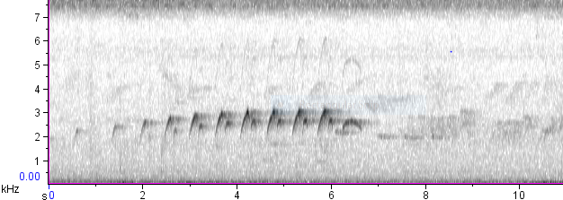
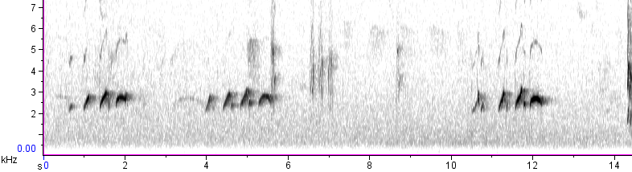

\

Muchas vocalizaciones en aves presentan variaciones entre regiones, lo cual ha sido atribuído a posibles hipótesis como la dificultad de migración por barreras físicas, diferencias morfológicas/genéticas/fisiológicas y  la tendencia de los juveniles de aprender los cantos a través de la imitación (Pods & Warren, 2007; Sober, Wohlgemuth & Brainard, 2008).  Este aprendizaje permite la herencia de patrones vocales estructurales a las siguientes generaciones que definen el canto característico de la población (Pods & Warren, 2007). Las diferencias obtenidas coinciden con los resultados del estudio de  Leger y Mountjoy (2003), donde analizaron la variación del canto de *A. spadiceus* según su ubicación geográfica. 
\
\
Otros estudios sugieren que las variaciones del canto entre regiones se deben a adaptaciones asociadas a las características propias del hábitat. La composición vegetal, el porcentaje de cobertura boscosa, humedad y temperatura pueden ser factores influyentes en la estructura del canto. Incluso existen reportes de que aves centroamericanas tienden a cantar con tonos más puros tipo silbidos en espacios boscosos densos que en campos abiertos como una posible adaptación ventajosa (Brumm & Naguib, 2009). Esto puede ser una posible explicación del porqué existe tanta variación en las métricas de los cantos entre países.
\
\

{width=1100px} 

**Figura 4.** Espectrograma Panamá.  

\
\

{width=1100px} 

**Figura 5.** Espectrograma Ecuador. 

\
\
Los valores máximos obtenidos con respecto a la frecuencia y duración de los cantos coinciden con los obtenidos en el estudio de Leger y Mountjoy (2003) donde América Central (Costa Rica y Panamá) obtuvo los valores más altos y América del Sur (Brasil, Colombia y Ecuador) los más bajos. Esto podría sugerir que ha habido una prevalencia de la estructura de la vocalización del canto a través de los años manteniendo su dialecto característico (Pods & Warren, 2007; Odom & Mennill, 2012). Sin embargo, no se puede directamente relacionar con patrones de aprendizaje debido a que no existen estudios ni siquiera en el género Attila sobre este comportamiento (Leger & Mountjoy, 2003; Odom & Mennill, 2012). 

\
\
**Conclusiones**
\

La variación de los cantos entre países es un fenómeno común en muchas especies de aves y se puede relacionar a factores tanto ambientales, de comportamiento, morfológicos y genéticos. Para llegar a resultados más robustos es necesario considerar estos parámetros para determinar porqué se generan estas diferencias y cuál factor podría tener mayor influencia sobre la estructura de los cantos

