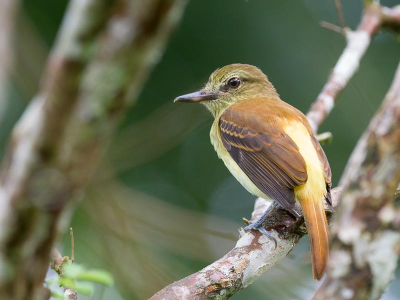
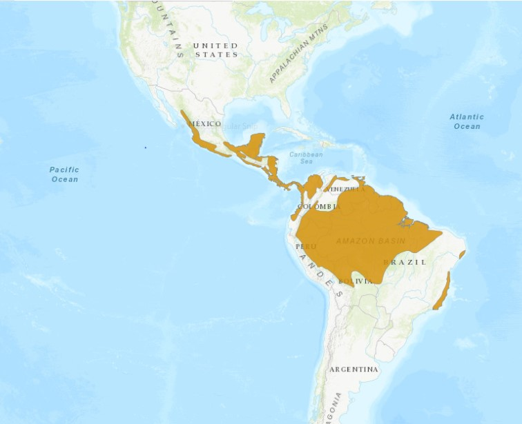

Escrito por: Sofia Pastor, Jose Lopez, Daniela Marín.
\

En temas de biología evolutiva, el reconocimiento de variaciones en el comportamiento de la misma especie relacionado a su distribución geográfica ha sido de alto interés de estudio por científicos para explicar procesos de especiación (Podos & Warren, 2007). En aves, el canto es una de las características más estudiadas en la actualidad, siendo un comportamiento aprendido de uso rutinario asociado a su entorno que podría tener componentes variables, incluso entre poblaciones de la misma región  (Sober, Wohlgemuth & Brainard, 2008).
\
*Attila spadiceus* es también conocida como "Bright-Rumped" en inglés, se caracteriza por presentar diferentes coloraciones en su plumaje, siendo considerado como un pájaro polimórfico. Además, tiene bastante plasticidad  en los ecosistemas en que se encuentra, frecuenta bosques secos y húmedos, claros sombreados y jardines cercanos a los bosques, se reporta en área de bajura hasta aproximadamente los 1850 msnm. 

\

{width=600px}

**Figura 1.** Fotografía de *Attila spadiceus* en la Península de Osa, Costa Rica.
Fuente: Paul van Giersbergen, IBC1402614 (2017).
\
\

Es un ave bulliciosa, con bastante actividad de movimiento entre los árboles y el suelo (Stiller & Skutch, 2007). Según reporta BirdLife International (2017), esta especie cuenta con una población estable con un estado de menor preocupación, con respecto a la conservación de de la misma. *Attila spadiceus* (Gmelin, JF, 1789) es un ave de distribución Neotropical, se ubica desde el noroeste de México hasta el sureste de Brasil y el oeste de Bolivia y Ecuador (Garrigues & Dean, 2014). Siendo un ave con amplia distribución, este informe pretende reportar diferencias entre países a partir de la comparación los valores obtenidos de las métricas características del canto como la frecuencia, poder y energía. 

{width=600px}

**Figura 2.** Distribución geográfica de la especie *Attila spadiceus*.
Fuente: Tomado de BirdLife International (2017).