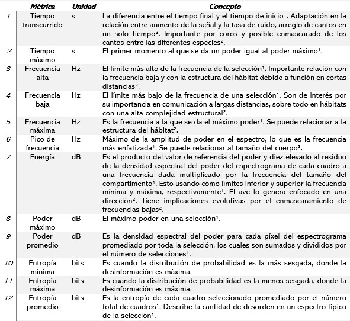

\

**Cantos**
\
Se tomaron entre 10-20 cantos de la especie para cada país (n = 83) de los servidores de Xeno-canto Foundation (https://www.xeno-canto.org). Estos cuentan con una colección de cantos de *A. spadiceus*  de 17 países y 26 categorías de vocalización. Para este trabajo se usaron solamente cantos de Brasil, Colombia, Costa Rica, Ecuador y Panamá. Todos los cantos fueron descargados a través de la función ‘querxc’ del paquete *warbleR* del lenguaje R (Araya-Salas & Smith-Vidaurre, 2017; R Core Team, 2018; Araya-Salas & Smith-Vidaurre, 2017).

\

**Métricas de audios**
\
Se utilizaron 12 métricas de audio para realizar el análisis del canto de los individuos de *A. spadiceus* de cada país, las métricas fueron escogidas debido a las funciones que permiten (Cuadro 1).

\
**Cuadro 1.** Significado de las métricas utilizadas.

{width=600px}

Fuente: ¹Brumm & Naguib, 2009; ²Charif, Waack & Strickman, 2010. 
\
\

**Análisis estadístico**
\
Para la comparación de los cantos de las aves se utilizó el promedio de 7- 35 fragmentos de cada uno de los 83 cantos recopilados.  Se utilizaron 12 métricas como variables respuesta y se tuvo un único factor explicativo, el cual fue el país de origen. Se realizó una prueba de normalidad para cada variable y sus residuos y se realizó una limpieza de los datos debido a valores extremos. Se realizó una comparación de grupos usando el método de Kruskal-Wallis para encontrar diferencias entre las variables del canto según el país. 

