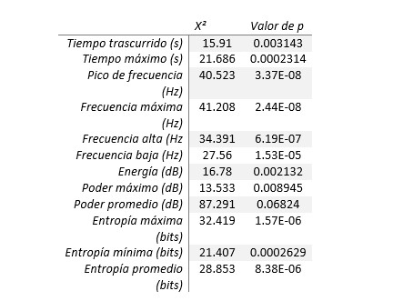
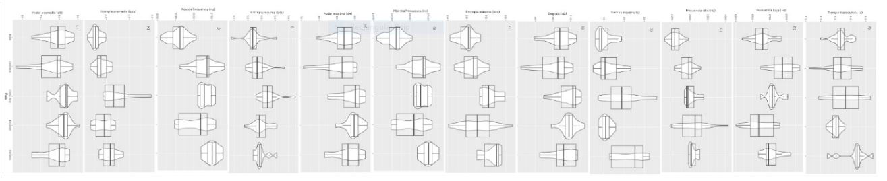
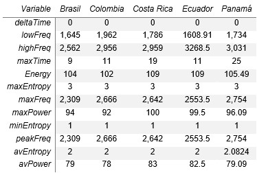

\

Todas las variables, con excepción del poder promedio, que caracterizan el canto de A. spadiceus resultaron ser diferentes por país (Cuadro 2). Esto es observable en la figura 3.

\

**Cuadro 2.** Resultados de la comparación con el método de rangos de Kruskal-Wallis de los descriptores del canto de A. spadiceus por cada país. Grados de libertad = 4.

{width=600px} 

\

{width=1100px} 

**Figura 3.** Comparación de métricas del canto de A. spadiceus. Se muestra la diferencia en la variación de los datos.  

\

De manera puntual, se encontró que en Costa Rica se dan los valores más altos de energía y poder máximo y promedio. Para Panamá se encontró la mayor duración de los cantos y los máximos valores de frecuencia y entropía. El caso de Ecuador es interesante debido a que se encontraron allí el mínimo valor de frecuencia baja, pero también el máximo valor de frecuencia alta (Cuadro 3).

\
\
**Cuadro 3.** Valores de la mediana de las métricas del canto de A. spadiceus para cada país.

{width=600px} 

